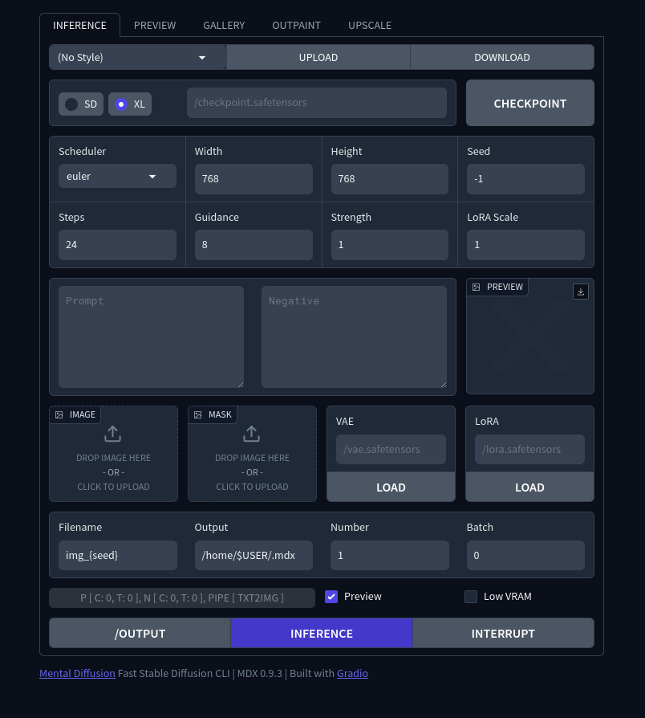

## Mental Diffusion

> **Notice**: The experiment is over and this repository is for learning purposes.

**Fast Stable Diffusion CLI**

| [MDX](https://github.com/nimadez/mental-diffusion/blob/main/src/mdx.py) | 0.9.5 |
| ------- | --- |
| Python | 3.11 - 3.12 |
| Torch | +cu121 |
| Diffusers | 0.30.2 |
| + Gradio | 4.42.0 |

> The **mdx.py** script is tested-stable.

## Features
- SD, **SDXL**
- Load VAE and LoRA weights
- Txt2Img, Img2Img, Inpaint *(auto-pipeline)*
- TAESD latents preview *(image and animation)*
- Batch image generation, multiple images per prompt
- Read/write PNG metadata, auto-rename files
- CPU, GPU, Low VRAM mode *(load SDXL with 4 GB)*
- Lightweight and fast, rewritten in **300** lines
- Proxy, offline mode, minimal downloads
- Gradio [user-interface](https://github.com/nimadez/mental-diffusion/?tab=readme-ov-file#user-interface) *(mdx-ui.py)*
- Real-ESRGAN x2 and x4 script *(mdx-upscale.py)*

## Installation
> - 3.5 GB python packages (5.5 GB extracted)
> - Compatible with most diffusers-based python venvs
> - Make sure you have a swap partition or swap file
```
git clone https://github.com/nimadez/mental-diffusion
cd mental-diffusion

# Automatic installation:
sudo apt install python3-pip python3-venv
sh install-venv.sh

# Manual installation:
python3 -m venv ~/.venv/mdx
source ~/.venv/mdx/bin/activate
pip install torch torchvision --extra-index-url https://download.pytorch.org/whl/cu121
pip install -r ./requirements.txt
deactivate
```
Install Gradio and Zenity for user-interface:
```
~/.venv/mdx/bin/python3 -m pip install gradio==4.42.0
sudo apt install zenity

* Zenity: If you don't have a GNOME desktop, you can't use the file dialog to select .safetensors files, you have to enter the Checkpoint, LoRA and VAE path manually.
```

## Arguments
```
~/.venv/mdx/bin/python3 mdx.py --help

--type        -t    str     sd, xl (def: custom)
--checkpoint  -c    str     /checkpoint.safetensors (def: custom)
--scheduler   -sc   str     ddim, ddpm, euler, eulera, lcm, lms, pndm (def: custom)
--prompt      -p    str     positive prompt
--negative    -n    str     negative prompt
--width       -w    int     divisible by 8 (def: custom)
--height      -h    int     divisible by 8 (def: custom)
--seed        -s    int     -1 randomize (def: -1)
--steps       -st   int     1 to 100+ (def: 24)
--guidance    -g    float   0 - 20.0+ (def: 8.0)
--strength    -sr   float   0 - 1.0 (def: 1.0)
--lorascale   -ls   float   0 - 1.0 (def: 1.0)
--image       -i    str     /image.png
--mask        -m    str     /mask.png
--vae         -v    str     /vae.safetensors
--lora        -l    str     /lora.safetensors
--filename    -f    str     filename prefix without .png extension, add {seed} to be replaced (def: img_{seed})
--output      -o    str     image and preview output directory (def: custom)
--number      -no   int     number of images to generate per prompt (def: 1)
--batch       -b    int     number of repeats to run in batch, --seed -1 to randomize
--preview     -pv           stepping is slower with preview enabled (def: no preview)
--lowvram     -lv           slower if you have enough VRAM, automatic on 4GB cards (def: no lowvram)
--metadata    -meta str     /image.png, extract metadata from png

[automatic pipeline]
Txt2Img: no --image and no --mask
Img2Img: --image and no --mask
Inpaint: --image and --mask
ERROR:   no --image and --mask
```
```
Default:    mdx -p "prompt" -st 28 -g 7.5
SD:         mdx -t sd -c /checkpoint.safetensors -w 512 -h 512
SDXL:       mdx -t xl -c /checkpoint.safetensors -w 768 -h 768
Img2Img:    mdx -i /image.png -sr 0.5
Inpaint:    mdx -i /image.png -m ./mask.png
VAE:        mdx -v /vae.safetensors
LoRA:       mdx -l /lora.safetensors -ls 0.5
Filename:   mdx -f img_test_{seed}
Output:     mdx -o /home/user/.mdx
Number:     mdx -no 4
Batch:      mdx -b 10
Preview:    mdx -pv
Low VRAM:   mdx -lv
Metadata:   mdx -meta ./image.png

mdx-upscale --help
mdx-upscale -i ./image.png
mdx-upscale -i ./image.png -m x2
mdx-upscale -i ./image.png -m x4 -o ~/Downloads
```

## User Interface
```
~/.venv/mdx/bin/python3 src/mdx-ui.py
sh mdx-ui
sh mdx-ui-dev   # development mode (auto reload)
open http://localhost:8011
```



## Direct Inference
Import MDX class to inference from JSON data

```
from mdx import MDX

data = json.loads(data)
data["prompt"] = "new prompt"

parser = argparse.ArgumentParser()
args = parser.parse_args(namespace=argparse.Namespace(**data))

MDX().main(args)
```
> Inference can be interrupted by creating a file named ".interrupt" in the --output directory. (e.g. mdx-ui.py)

## Tips & Tricks
```
* Enable OFFLINE if you have already downloaded the huggingface cache
* Enable SAVE_ANIM to save the preview animation to {output}/filename.webp
* Model may be slow to load on first launch, but reloading SDXL with 4GB only takes a second

Preview, cancel, and repeat faster:
mdx -p "prompt" -g 8.0 -st 30 -pv
mdx -p "prompt" -g 8.0 -st 30 -s 827362763262387

Content-aware upscaling: (ImageMagick)
mdx -p "prompt" -st 20 -w 512 -h 512 -f image
magick convert ~/.mdx/image.png -resize 200% ~/.mdx/image_up.png
mdx -p "prompt" -st 20 -i ~/.mdx/image_up.png -sr 0.5

Generate 40 images in less time:
mdx -p "prompt" -b 10 -no 4

Extract images from WebP animation: (ImageMagick)
magick convert image.webp jpg

Explore output directory in a browser across the LAN:
cd ~/.mdx && python3 -m http.server 8000
$ open http://192.168.x.x:8000

Download huggingface cache in a specific path:
mkdir ~/.hfcache && ln -s ~/.hfcache ~/.cache/huggingface
```

## Previous Experiments


> - [Legacy command-line interface and server](https://github.com/nimadez/mental-diffusion/tree/main/legacy/README.md) (diffusers)
> - [ComfyUI bridge for VS Code extension](https://github.com/nimadez/mental-diffusion/tree/main/comfyui/README.md)

## History
```
↑ Add Gradio user-interface
↑ Rewritten in 300 lines
↑ Port to Linux
↑ Back to Diffusers
↑ Port to Code (webui)
↑ Change to ComfyUI API (webui)
↑ Created for personal use (diffusers)

"AI will bring us back to the age of terminals."
```

## License
Code released under the [MIT license](https://github.com/nimadez/mental-diffusion/blob/main/LICENSE).

## Credits
- [Hugging Face](https://huggingface.co/)
- [Diffusers](https://github.com/huggingface/diffusers)
- [Transformers](https://github.com/huggingface/transformers)
- [PyTorch](https://pytorch.org/)
- [Stability-AI](https://github.com/Stability-AI)
- [TAESD](https://github.com/madebyollin/taesd)
- [Real-ESRGAN](https://github.com/xinntao/Real-ESRGAN)
- [Gradio](https://www.gradio.app/)

##### Models
- zavychromaxl_v80
- OpenDalleV1.1
- juggernaut_aftermath
