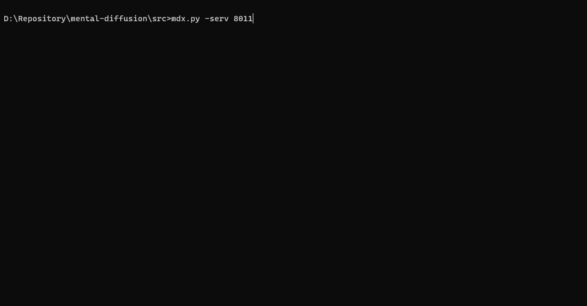
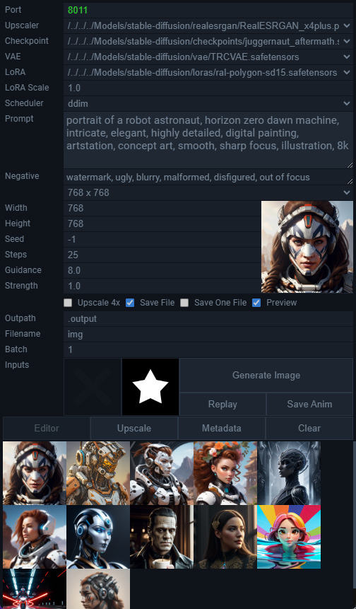
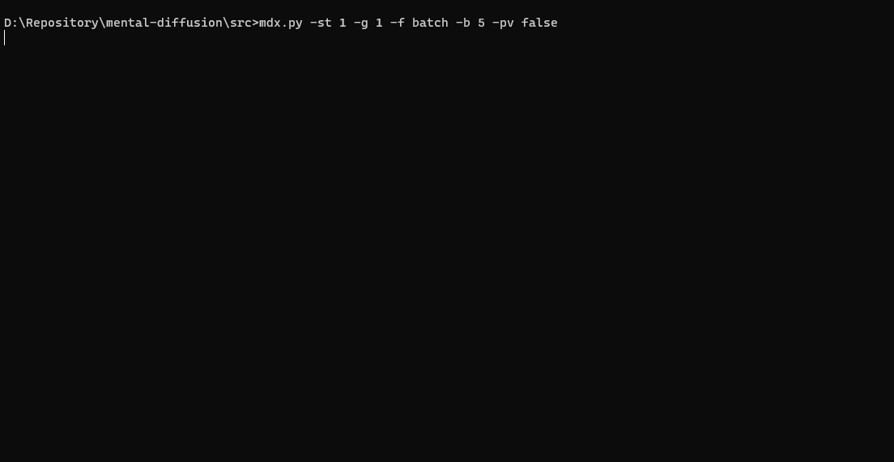

## Mental Diffusion

Stable diffusion command-line interface

```Version 0.6.9 alpha```

[Downloads](https://github.com/nimadez/mental-diffusion/releases)<br>
[ComfyUI Bridge for VS Code](https://github.com/nimadez/mental-diffusion/tree/main/comfyui)<br>
[Changelog](https://github.com/nimadez/mental-diffusion/blob/main/CHANGELOG.md)<br>
[Known Issues](https://github.com/nimadez/mental-diffusion#known-issues)

> Everything gets complicated from this part down ↓, if you want less headache you can use comfyui-bridge ↑


- Command-line interface
- Websockets server
- Websockets client ```electron```
- SD, SDXL, SDXL-Turbo, VAE, LoRA
- Text-to-Image, Image-to-Image, Inpaint
- Latent preview (TAESD/XL)
- Upscaler realesrgan 4x
- Read and write PNG with metadata
- Optimized for low specs

```
--help                     show this help message and exit

--model      -mod   str    sd/xl, define model type, (def: config.json)
--checkpoint -c     str    set checkpoint by file name or path (def: config.json)
--upscaler   -u     str    optional realesrgan by file name or path (def: config.json)
--vae        -v     str    optional vae by file name or path (def: None)
--lora       -l     str    optional lora by file name or path (def: None)
--lorascale  -ls    float  0.0-1.0, lora scale (def: 1.0)
--scheduler  -sc    str    ddpm, ddim, pndm, lms, euler, euler_anc (def: config.json)
--prompt     -p     str    positive prompt text input (def: sample)
--negative   -n     str    negative prompt text input (def: sample)
--width      -w     int    width value must be divisible by 8 (def: config.json)
--height     -h     int    height value must be divisible by 8 (def: config.json)
--seed       -s     int    seed number, -1 to randomize (def: -1)
--steps      -st    int    steps from 1 to 100 (def: 25)
--guidance   -g     float  guidance scale, how closely linked to the prompt (def: 8.0)
--strength   -sr    float  how much respect the final image should pay to the original (def: 1.0)
--image      -i     str    PNG file path or base64 PNG (def: None)
--mask       -m     str    PNG file path or base64 PNG (def: None)
--upscale    -up    bool   true/false, auto-upscale using realesrgan 4x (def: false)
--savefile   -sv    bool   true/false, save image to PNG, contain metadata (def: true)
--onefile    -of    bool   true/false, save the final result only (def: false)
--outpath    -o     str    /path-to-directory (def: .output)
--filename   -f     str    filename prefix (no png extension)
--batch      -b     int    enter number of repeats to run in batch (def: 1)

--server     -serv  int    start websockets server (port is required)
--metadata   -meta  str    /path-to-image.png, extract metadata from PNG
--upscale4x  -up4x  str    /path-to-image.png, upscale a PNG

[automatic pipeline switch]
txt2img: when the 'image' is empty, the pipeline switches to txt2img
img2img: when the 'image' is not empty, the pipeline switches to img2img
inpaint: when the 'image' and 'mask' are not empty, the pipeline switches to inpaint

* --server or --batch is recommended because there is no need to reload the checkpoint
* SDXL-Turbo: 512x512, --steps from 1 to 5, set --guidance to 0.0
* To load SDXL on 3.5 GB, you need at least 16 GB memory and virtual-memory paging
```

```
[config.json]
define models and startup values

{
    "http_proxy": null,
    
    "checkpoints": [
        "/path-to/checkpoint1.safetensors",
        "/path-to/checkpoint2.safetensors",
        ...
    ],
    
    "vaes": [
        "/path-to/vae1.safetensors",
        "/path-to/vae2.safetensors",
        ...
    ],

    "loras": [
        "/path-to/lora1.safetensors",
        "/path-to/lora2.safetensors",
        ...
    ],

    "upscalers": [
        "/path-to/realesrgan/RealESRGAN_x4plus.pth",
        "/path-to/realesrgan/RealESRGAN_x4plus_anime_6B.pth"
    ],

    "model": "xl", // sd or xl
    "scheduler": "euler_anc",
    "width": 1024,
    "height": 1024
}
```

### Websockets server


### Websockets client


### Batch


## Known Issues
```
Latent preview is not fully supported by discrete schedulers and SDXL:
- DDPMScheduler                     realtime SD, basic SDXL
- DDIMScheduler                     realtime SD, basic SDXL
- PNDMScheduler                     realtime SD, basic SDXL
- LMSDiscreteScheduler              basic SD/SDXL
- EulerDiscreteScheduler            basic SD/SDXL
- EulerAncestralDiscreteScheduler   basic SD/SDXL
* Probably, in the next versions of diffusers, this problem will be solved by itself.

TypeError: StableDiffusionPipeline.__init__() got an unexpected keyword argument 'safety_checker'
- The selected --model (sd/xl) does not match the checkpoint
```

## History
```
↑ Back to the roots (diffusers)
↑ Ported to VS Code
↑ Switch from Diffusers to ComfyUI
↑ Upgrade from sdkit to Diffusers
↑ Undiff renamed to Mental Diffusion
↑ Undiff started with "sdkit"
↑ Created for my personal use
```


## License
Code released under the [MIT license](https://github.com/nimadez/mental-diffusion/blob/main/LICENSE).

## Credits
- [Hugging Face](https://huggingface.co/)
- [Diffusers](https://github.com/huggingface/diffusers)
- [PyTorch](https://pytorch.org/)
- [Stability-AI](https://github.com/Stability-AI)
- [Real-ESRGAN](https://github.com/xinntao/Real-ESRGAN)
- [TAESD](https://github.com/madebyollin/taesd)
- [Electron](https://www.electronjs.org/)


