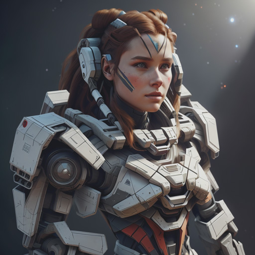

## Mental Diffusion

Stable diffusion command-line interface

```Version 0.7.4 alpha```

[ComfyUI Bridge for VS Code](https://github.com/nimadez/mental-diffusion/tree/main/comfyui)


- Command-line interface
- Websockets server
- Websockets client ```electron```
- SD 1.5, SDXL, SDXL-Turbo
- TAESD, VAE, LoRA
- Text-to-Image, Image-to-Image, Inpaint
- Latents preview (bmp/webp)
- Upscaler Real-ESRGAN x2-x4-anime
- Read and write PNG with metadata
- Optimized for low specs
- Support CPU and GPU

## Installation
- Install Python 3.11.x
- Install Python packages *(see installer.py or requirements.txt)*
- Install Electron
```
git clone https://github.com/nimadez/mental-diffusion.git
edit src/config.json
```
### Start server
```
python mdx.py -serv 8011
```
### Start client
```
electron .
```
### Start cli
```
python mdx.py -p "prompt" -c /sd.safetensors -st 20 -g 7.5 -f img_{seed}
python mdx.py -p "prompt" -mod xl -c /sdxl.safetensors -w 1024 -h 1024 -st 30 -g 8.0 -f img_{seed}
```
##### These models are downloaded as needed after launch:
```
RealESRGAN_x2plus.pth
RealESRGAN_x4plus.pth
RealESRGAN_x4plus_anime_6B.pth
madebyollin/taesd
madebyollin/taesdxl
openai/clip-vit-large-patch14 (diffusers, 1.7 GB)
laion/CLIP-ViT-bigG-14-laion2B-39B-b160k (diffusers)
```


## Command-line
```
--help                     show this help message and exit

--server     -serv  int    start websockets server (port is required)
--metadata   -meta  str    /path-to-image.png, extract metadata from PNG

--model      -mod   str    sd/xl, set checkpoint model type (def: config.json)
--checkpoint -c     str    checkpoint .safetensors path (def: config.json)
--vae        -v     str    optional vae .safetensors path (def: null)
--lora       -l     str    optional lora .safetensors path (def: null)
--lorascale  -ls    float  0.0-1.0, lora scale (def: 1.0)
--scheduler  -sc    str    ddim, ddpm, lcm, pndm, euler_anc, euler, lms (def: config.json)
--prompt     -p     str    positive prompt text input (def: sample)
--negative   -n     str    negative prompt text input (def: empty)
--width      -w     int    width value must be divisible by 8 (def: config.json)
--height     -h     int    height value must be divisible by 8 (def: config.json)
--seed       -s     int    seed number, -1 to randomize (def: -1)
--steps      -st    int    steps from 1 to 100+ (def: 25)
--guidance   -g     float  0.0-20.0+, how closely linked to the prompt (def: 8.0)
--strength   -sr    float  0.0-1.0, how much respect the image should pay to the original (def: 1.0)
--image      -i     str    PNG file path or base64 PNG (def: null)
--mask       -m     str    PNG file path or base64 PNG (def: null)
--savefile   -sv    bool   true/false, save image to PNG, contain metadata (def: true)
--onefile    -of    bool   true/false, save the final result only (def: false)
--outpath    -o     str    /path-to-directory (def: .output)
--filename   -f     str    filename prefix (no png extension)
--batch      -b     int    enter number of repeats to run in batch (def: 1)
--preview    -pv    bool   stepping is slower with preview enabled (def: false)
--upscale    -up    str    x2, x4, x4anime (def: null)

[automatic pipeline switch]
txt2img: when the 'image' is empty, the pipeline switches to txt2img
img2img: when the 'image' is not empty, the pipeline switches to img2img
inpaint: when the 'image' and 'mask' are not empty, the pipeline switches to inpaint

[model settings]
SDXL: 1024x1024 or 768x768, --steps >20
SDXL-Turbo: 512x512, --steps 1-4, --guidance 0.0
LCM-LoRA: "lcm" scheduler, --steps 2-8+, --guidance 0.0-2.0

* --server or --batch is recommended because there is no need to reload the checkpoint
* Add "{seed}" to --filename, which will be replaced by seed later
* To load SDXL on 3.5 GB, you need at least 16 GB memory and virtual-memory paging
```

## Websockets Client


```
- Use Electron to reduce the risk of data loss due to disconnection
- Client fetch config data from server on first launch only (refresh to update)
- You can continue the preview result with img2img by drag and drop
- The last replay is always available and saveable in .webp format
- Prompts, outpath and filename are saved and retrieved on refresh
- The upscaled image is saved to the file and is not returned
- Right click on the images to open popup menu
```

### Latents Preview


### Test LoRA + VAE
<br>
<sub>* *Juggernaut Aftermath, TRCVAE, World of Origami*</sub>

### Test SDXL
<br>
<sub>* *OpenDalleV1.1*</sub>

### Test SDXL-Turbo
<br>
<sub>* *A cinematic shot of a baby racoon wearing an intricate italian priest robe.*</sub>

## Known Issues
```
:: Latents preview is not fully supported for SDXL

:: Stepping is slower with preview enabled
We used the BMP format which has no compression.
Reminder: one solution is to set "pipe._guidance_scale" to 0.0 after 40%

:: Interrupt button does not work
You have to wait for the current step to finish,
The interrupt operation is applied at the beginning of each step.
```

## History
```
↑ Back to the roots (diffusers)
↑ Ported to VS Code
↑ Switch from Diffusers to ComfyUI
↑ Upgrade from sdkit to Diffusers
↑ Undiff renamed to Mental Diffusion
↑ Undiff started with "sdkit"
↑ Created for my personal use
```


## License
Code released under the [MIT license](https://github.com/nimadez/mental-diffusion/blob/main/LICENSE).

## Credits
- [Hugging Face](https://huggingface.co/)
- [Diffusers](https://github.com/huggingface/diffusers)
- [PyTorch](https://pytorch.org/)
- [Stability-AI](https://github.com/Stability-AI)
- [Real-ESRGAN](https://github.com/xinntao/Real-ESRGAN)
- [TAESD](https://github.com/madebyollin/taesd)
- [Electron](https://www.electronjs.org/)
- [meta-png](https://github.com/lucach/meta-png)