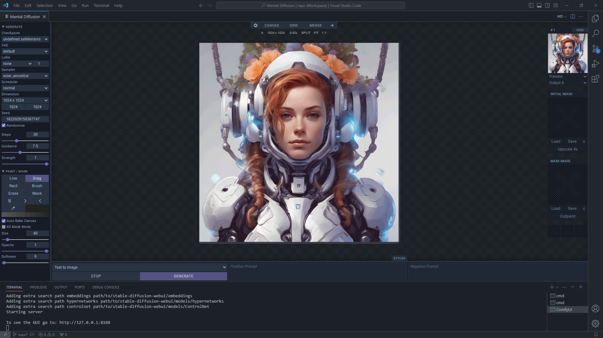
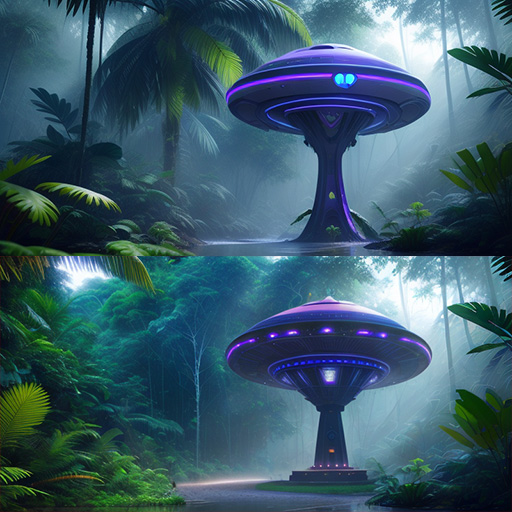

## ComfyUI Bridge for VS Code

<br>

## Features
- [x] VS Code Extension
- [x] Text to Image
- [x] Image to Image
- [x] Image Inpainting
- [x] Image Outpainting
- [x] Painting Canvas
- [x] Quick Mask Painting
- [x] LoRA and Custom VAE
- [x] Upscaler 4x
- [x] PNG Metadata
- [x] Canvas editor
- [x] Grid editor
- [x] Model merging
- [x] Styles popup *(experimental)*
- [x] Batch rendering
- [x] Drag and drop images
- [x] Preview and progress bar
- [x] Resolution presets
- [x] Image comparison A/B
- [x] 3 permanent local storages
- [x] Works completely offline
- [x] Ad-free, no trackers

#### Customizables
- [x] Theme color
- [x] Splash image
- [x] Custom workflows
- [x] Image output directory
- [x] Editable styles.json
- [x] Resizable windows/editors
- [x] Preferences
- [x] Extension Settings

## Installation
- Get [Visual Studio Code](https://code.visualstudio.com/download)
- Get [ComfyUI](https://github.com/comfyanonymous/ComfyUI/releases) and setup models
- Download [RealESRGAN_x4plus.pth](https://github.com/xinntao/Real-ESRGAN/releases/download/v0.1.0/RealESRGAN_x4plus.pth) to "ComfyUI/models/upscale_models"
- Copy or symlink "comfyui" directory to "vscode/data/extensions/"

#### Running
- Open *Extension Settings*
- Define the ComfyUI source path and Python path
- Run MD
```
MD:  ComfyUI server + MD UI
MDC: ComfyUI server only
MDU: MD UI only
```
You can also run ComfyUI server standalone with these two arguments:
```
main.py --enable-cors-header --preview-method auto
```

## Quickstart
- MD uses PNG files to save and load metadata
- MD can load single or multiple PNG files
- Your data is safe and can be loaded again as long as "Autosave File" is checked
- You can guide the image-to-image using brush strokes and color adjustments
- To create a mask image, draw using the Mask tool or check the "All mask mode"
- The upscaled image is saved to the file and is not returned
- LoRA and VAE are supported by all workflows

#### The canvas consists of 3 layers
- **Front (A)**: Painting canvas *(to paint and mask)*
- **Middle (A)**: Image canvas *(editable using Canvas Editor)*
- **Back (B)**: Background image *(to compare and preview)*
> Important: If you want your painting/adjustments to combine with the original image, you need to "Bake" the canvas or check "Auto-bake canvas", useful when copy, save or dragging the canvas, sometimes you need to drag or save the original image.

#### Default Workflows
| *Workflow* | *Strength* | *How To* |
| --- | --- | --- |
| TXT2IMG | 1.0 | Select "Text to Image" workflow and render |
| IMG2IMG | 0.01 - 0.99 | Select "Image to Image" workflow and load the "Initial Image" |
| INPAINT | 1.0 | Select "Inpaint" workflow and draw the mask |
| INPAINT PRO | 0.01 - 1.0 | Select "Inpaint Pro" workflow, load the "Initial Image" and draw the mask *(this workflow allows the strength amount to be used for inpainting)* |
| OUTPAINT | 1.0 | Select "Inpaint" workflow and open "Outpaint" window to set paddings (There are always issues with the result that you can fix with "Inpaint/Pro" workflows) |

> Img2img example *(left is the original)*:<br>


> Inpaint example *(top is the original)*:<br>


> Outpaint example *(left is the original)*:<br>


> Outpaint tests *(padding 128 and 256)*:<br>


#### Mouse controls
| *Key* | *Action* |
| --- | --- |
| Left Button | Drag, draw, select |
| Middle Button | Reset pan and fit |
| Right Button | Pan canvas |
| Wheel | Zoom canvas in/out |

#### Keyboard shortcuts
| *Key* | *Action* |
| --- | --- |
| 0 - 9 | Select workflows |
| B | Bake canvas |
| D | Drag tool |
| B | Brush tool |
| L | Line tool |
| E | Eraser tool |
| M | Mask tool |
| I | Activate eyedropper |
| R | Reset canvas zoom |
| ] | Increase tool size |
| [ | Decrease tool size |
| + | Increase tool opacity |
| - | Decrease tool opacity |
| CTRL + Enter | Render/Generate |
| CTRL + L | Load PNG metadata |
| CTRL + Z | Undo painting |
| CTRL + X | Redo painting |

## Custom Workflows
```Notice: Experimental```

Basically, you can load any ComfyUI workflow API into mental diffusion<br>
Just copy JSON file to "**.workflows**" directory and replace tags

- Create "my_workflow_api.json" file in ".workflows" directory
- Replace supported tags *(with quotation marks)*
- Reload webui to refresh workflows
- Select workflow and hit Render button
```
"_seed_"
"_steps_"
"_cfg_"
"_sampler_name_"
"_scheduler_"
"_denoise_"
"_ckpt_name_"
"_vae_name_"
"_lora_name_"
"_lora_strength_"
"_width_"
"_height_"
"_widthx2_"
"_heightx2_"
"_positive_"
"_negative_"
"_image_init_"
"_image_mask_"
"_is_changed_" (to force comfyui to update the input image)
```
* *Tags are optional, you can choose according to your needs*
* *See examples in "configs" directory*
```
How to generate "workflow_api.json" file?
- Open ComfyUI http://localhost:8188/
- Open settings (gear icon)
- Check "Enable Dev mode options"
- Click "Save (API Format)"
```

## License
Code released under the [MIT license](https://github.com/nimadez/mental-diffusion/blob/main/LICENSE).

## Credits
- [Visual Studio Code](https://code.visualstudio.com/)
- [ComfyUI](https://github.com/comfyanonymous/ComfyUI)
- [Hugging Face](https://huggingface.co/)
- [Stability-AI](https://github.com/Stability-AI)
- [Real-ESRGAN](https://github.com/xinntao/Real-ESRGAN)
- [meta-png](https://github.com/lucach/meta-png)
- [Google TPU v5e demo](https://huggingface.co/spaces/google/sdxl)
