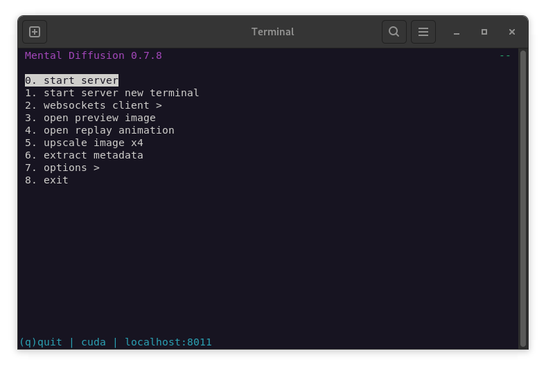
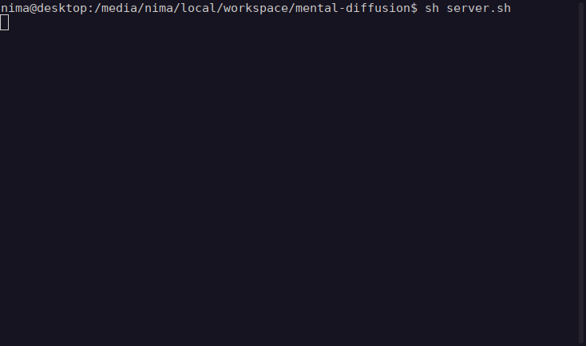
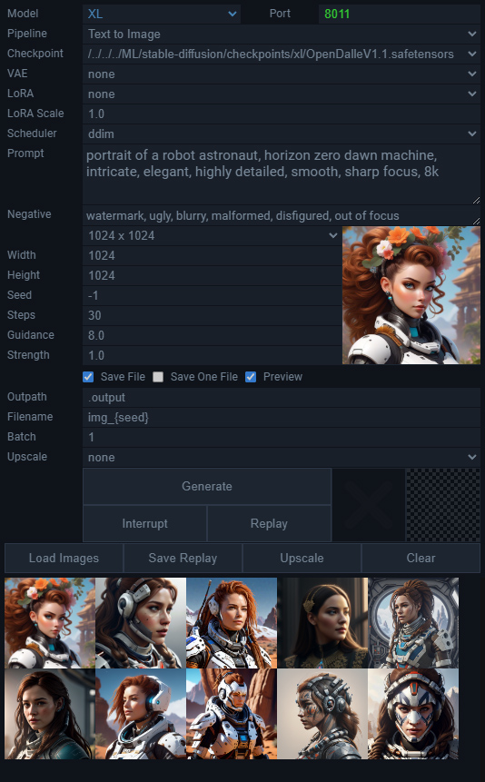

## Mental Diffusion


Stable diffusion command-line interface<br>
Powered by [Diffusers](https://github.com/huggingface/diffusers)

```Version 0.7.8 alpha```<br>
```Python 3.11-3.12, Torch cu118-cu121```

[Features](https://github.com/nimadez/mental-diffusion/legacy#features)<br>
[Installation](https://github.com/nimadez/mental-diffusion/legacy#installation)<br>
[Help](https://github.com/nimadez/mental-diffusion/legacy#command-line)<br>
[Known Issues](https://github.com/nimadez/mental-diffusion/legacy#known-issues)<br>
[FAQ](https://github.com/nimadez/mental-diffusion/legacy#faq)

## Features
- Command-line interface
- Websockets server
- Curses terminal menu
- SD 1.5, SDXL, SDXL-Turbo
- VAE, TAESD, LoRA
- Text-to-Image, Image-to-Image, Inpaint
- Latent preview for SD/SDXL (bmp/webp)
- Upscaler Real-ESRGAN x2/x4/x4anime
- Read and write PNG with metadata
- Optimized for low vram
- Support CPU and GPU
- Support offline mode and http-proxy
- Fast startup
- JSON config file

## Installation
- Install Python 3.11 / 3.12
- Install Python packages in a venv *(see install.sh or requirements.txt)*
- The curses terminal menu is only available on Linux<br>
  Requirements: venv, nano, node, xdg-open
```
git clone https://github.com/nimadez/mental-diffusion.git
python3 -m venv ~/.venv/mdx     # create a new venv
source ~/.venv/mdx/bin/activate # activate the venv
sh install.sh
deactivate
nano src/config.json
```
### Start headless
```
SD15: mdx.py -p "prompt" -c /sd15.safetensors -st 20 -g 7.5 -f img_{seed}
SDXL: mdx.py -p "prompt" -mode xl -c /sdxl.safetensors -w 1024 -h 1024 -st 30 -g 8.0 -f img_{seed}
Img2Img: mdx.py -p "prompt" -pipe img2img -i image.png -sr 0.5
Inpaint: mdx.py -p "prompt" -pipe inpaint -i image.png -m mask.png
Upscale: mdx.py -upx4 image.png
```
### Start curses menu
```
~/.venv/python3 src/mdx.py
```
### Start server
```
~/.venv/python3 src/mdx.py -serv
```
### Show preview
```
open http://localhost:port
```
### Run node.js client
```
nano tests/ws-client.js && node tests/ws-client.js
```
##### These models are downloaded as needed after launch:
```
openai/clip-vit-large-patch14 (hf-cache)
laion/CLIP-ViT-bigG-14-laion2B-39B-b160k (hf-cache)
madebyollin/taesd (hf-cache)
madebyollin/taesdxl (hf-cache)
RealESRGAN_x2plus.pth (optional, src/models/realesrgan)
RealESRGAN_x4plus.pth (optional, src/models/realesrgan)
RealESRGAN_x4plus_anime_6B.pth (optional, src/models/realesrgan)
```



## Help
```
[ config.json ]
use_cpu: use cpu instead of gpu
low_vram: if possible, it avoids cuda out of memory error
offline: you can enable it after downloading huggingface cache models
http_proxy: bypass or protect privacy (e.g. http://localhost:8118)
host: localhost, 192.168.1.10, 0.0.0.0
port: a valid port number
output: image output directory (e.g. ~/img_output)
onefile: when auto-upscale is enabled, the original image is not saved
interrupt_save: save image after interrupt (the preview gives a more suitable image)
```
```
[ command-line arguments ]
--help                     show this help message and exit

--server     -serv         start websockets server (port: config.json)
--upscaler   -upx4  str    /path-to-image.png, upscale image x4
--metadata   -meta  str    /path-to-image.png, extract metadata from PNG

--model      -mode  str    sd/xl, set checkpoint model type (def: config.json)
--pipeline   -pipe  str    txt2img/img2img/inpaint, define pipeline (def: txt2img)
--checkpoint -c     str    checkpoint .safetensors path (def: config.json)
--vae        -v     str    optional vae .safetensors path (def: null)
--lora       -l     str    optional lora .safetensors path (def: null)
--lorascale  -ls    float  0.0-1.0, lora scale (def: 1.0)
--scheduler  -sc    str    ddim, ddpm, lcm, pndm, euler_anc, euler, lms (def: config.json)
--prompt     -p     str    positive prompt text input (def: sample)
--negative   -n     str    negative prompt text input (def: empty)
--width      -w     int    width value must be divisible by 8 (def: config.json)
--height     -h     int    height value must be divisible by 8 (def: config.json)
--seed       -s     int    seed number, -1 to randomize (def: -1)
--steps      -st    int    steps from 1 to 100+ (def: 20)
--guidance   -g     float  0.0-20.0+, how closely linked to the prompt (def: 8.0)
--strength   -sr    float  0.0-1.0, how much respect the image should pay to the original (def: 1.0)
--image      -i     str    PNG file path or base64 PNG (def: null)
--mask       -m     str    PNG file path or base64 PNG (def: null)
--base64     -64           do not save the image to a file, get base64 only
--filename   -f     str    filename prefix (no png extension)
--batch      -b     int    enter number of repeats to run in batch (def: 1)
--preview    -pv           stepping is slower with preview enabled
--upscale    -up    str    auto-upscale x2, x4, x4anime (def: null)

[ http server requests ]
curl http://localhost:port/preview --output preview.bmp
curl http://localhost:port/replay --output preview.webp
curl http://localhost:port/progress (return { step: int, timestep: int })
curl http://localhost:port/interrupt
curl http://localhost:port/config (return config.json)

* --server or --batch is recommended because there is no need to reload the checkpoint
* add "{seed}" to --filename, which will be replaced by seed later
* ~/ and $USER accepted for file and directory paths
```



## Test Websockets Client


### Test Latent Preview


### Test LoRA + VAE
<br>
<sub>* *Juggernaut Aftermath, TRCVAE, World of Origami*</sub>

### Test SDXL
<br>
<sub>* *OpenDalleV1.1*</sub>

### Test SDXL-Turbo
<br>
<sub>* *A cinematic shot of a baby racoon wearing an intricate italian priest robe.*</sub>

## Known Issues
```
:: Stepping is slower with preview enabled
We used the BMP format which has no compression.
Reminder: one solution is to set "pipe._guidance_scale" to 0.0 after 40%

:: Interrupt operation does not work
You have to wait for the current step to finish,
the interrupt operation is applied at the end of each step.

:: The server does not start from the terminal menu
If you are running MD for the first time and the
huggingface cache is missing, start the server using:
~/.venv/python3 src/mdx.py -serv
```

## FAQ
```
:: How to load SDXL with 3.5 GB VRAM?
To load SDXL, you need at least 16 GB RAM and a virtual-memory paging.

:: How to download HuggingFace models in a specific path?
ln -s /media/user/path-to-huggingface-cache ~/.cache/huggingface
```

## License
Code released under the [MIT license](https://github.com/nimadez/mental-diffusion/blob/main/LICENSE).

## Credits
- [Hugging Face](https://huggingface.co/)
- [Diffusers](https://github.com/huggingface/diffusers)
- [PyTorch](https://pytorch.org/)
- [Stability-AI](https://github.com/Stability-AI)
- [Real-ESRGAN](https://github.com/xinntao/Real-ESRGAN)
- [TAESD](https://github.com/madebyollin/taesd)
- [AUTOMATIC1111](https://github.com/AUTOMATIC1111/stable-diffusion-webui)
- [meta-png](https://github.com/lucach/meta-png)
